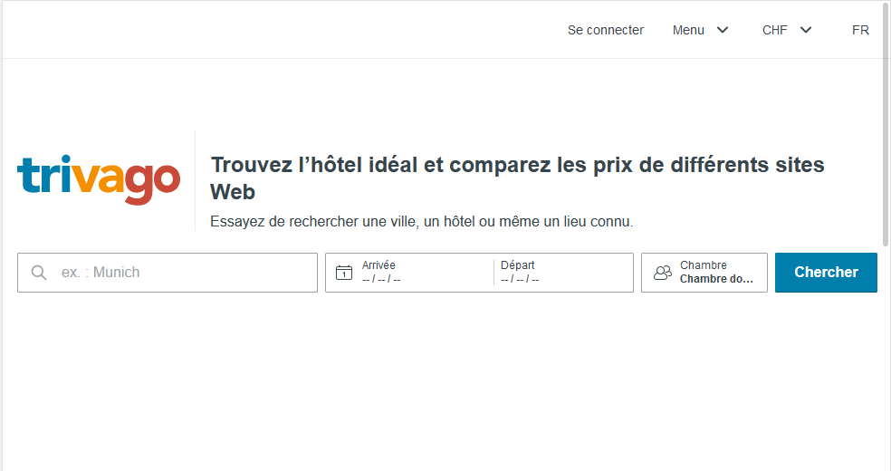
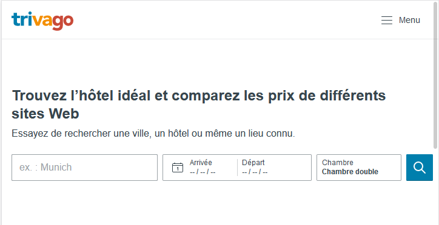
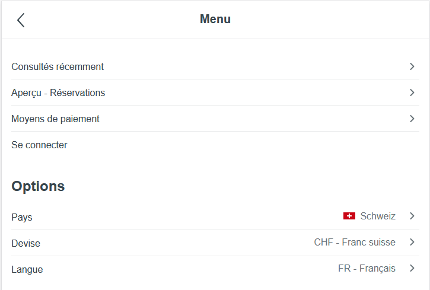
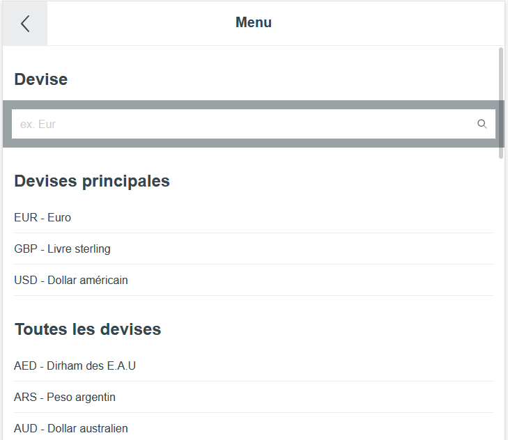
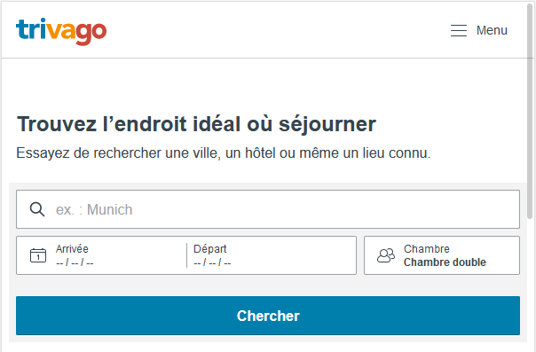

# Responsive behavior
## Desktop

* The menu is totally visible
* The submenu appears directly on the page
* The logo is between the menu and the form
* There is a title next to the logo
* The form is single line

## Tablet

* Width < 980 px
* The menu is hidden a button
* The menu takes the entire page
* The submenus take the entire page
* The logo is on the menu bar
* The title is still there
* The form is identical to the desktop one

## Mobile

* Width < 720 px
* The menu and submenus are identical to the tablet ones
* The title is shorter
* The form is now multiline